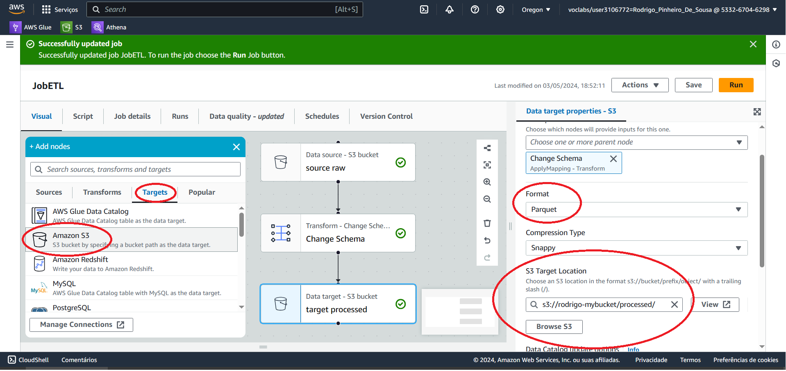

# Projeto ETL para Processamento de Dados no AWS Glue
Este projeto visa desenvolver um pipeline de ETL (Extract, Transform and Load) utilizando os serviços AWS Glue e AWS S3 para processamento de dados. O objetivo principal é extrair dados brutos armazenados em um bucket S3, realizar transformações necessárias nos dados e carregá-los em um formato adequado para análise posterior. 

## Arquitetura

___________________________________________________________

1- Preparação do Ambiente: Criação de um bucket S3 com duas pastas distintas, uma para armazenamento de dados brutos e outra para dados transformados.

___________________________________________________________

2- Extração: Utilização da função Crawler do AWS Glue para varrer a pasta de dados brutos no bucket S3, criando um catálogo de dados e metadados com o Glue Data Catalog.

___________________________________________________________

3- Transformação: Utilizando do AWS Glue Studio para definir e executar transformações nos dados brutos, permitindo modificações visuais ou através de linguagem de programação. Exemplo de transformação inclui a remoção de colunas desnecessárias.

___________________________________________________________

4- Carregamento: Configuração do carregamento dos dados transformados para uma nova localização no bucket S3, onde os dados processados serão armazenados e transformados em um formato adequado para análise posterior,

___________________________________________________________

5- Análise de Dados: E por fim, a utilização do Amazon Athena para executar consultas SQL e visualizar as mudanças nos dados processados.

